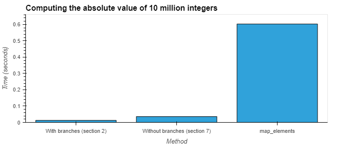

# 7. Branch mispredictions

Time to go back to the past. In Section 2, I told you that the
implementation we had of `abs_i64` wasn't the most efficient one
you could possibly write. Time to see how to improve it!

Who would win:

- only calculating `.abs` for non-null rows
- calculating `.abs` for all rows, even if they're null

?

If you've not come across the concept of branch mispredictions
before, then the answer may surprise you, because the second
one is faster here. This is because `.abs` is a very fast
operation, and the time spent figuring out whether each row
is valid or not dwarves the actual `.abs` calculation.

Here's how you can make `abs_i64` faster:

```rust
#[polars_expr(output_type=Int64)]
fn abs_i64(inputs: &[Series]) -> PolarsResult<Series> {
    let s = &inputs[0];
    let ca = s.i64()?;
    let chunks = ca
        .downcast_iter()
        .map(|arr| arr.values().as_slice())
        .zip(ca.iter_validities())
        .map(|(slice, validity)| {
            let arr: Int64Array = slice.iter().copied().map(|x| x.abs()).collect_arr();
            arr.with_validity(validity.cloned())
        });
    let out = Int64Chunked::from_chunk_iter(ca.name(), chunks);
    Ok(out.into_series())
}
```

or, if you like to keep things simple (this kind of operation is
so common in Polars that there's a convenience method
for it: `apply_values`):
```Rust
#[polars_expr(output_type=Int64)]
fn abs_i64(inputs: &[Series]) -> PolarsResult<Series> {
    let s = &inputs[0];
    let ca = s.i64()?;
    let out = ca.apply_values(|x| x.abs());
    Ok(out.into_series())
}
```

For more complex operations, it may be that computing the operation
for only the non-null values is cheaper. In general, you should
measure, not guess.
If you're just starting out with plugins and only need to beat
`.map_elements`, then either of these solutions will blow it out
of the water.



## Practice!

Can you go back and make a faster version of `sum_i64`?
