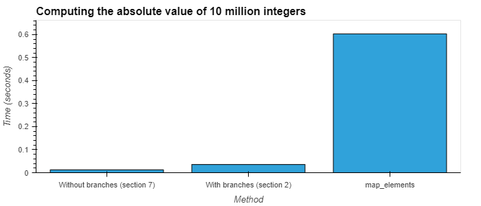

# 7. Branch mispredictions

Time to go back to the past. In Section 2, I told you that the
implementation we had of `abs_i64` wasn't the most efficient one
you could possibly write. Time to see how to improve it!

Which algorithm do you think would win?

1. row each row:
    - check if it's null or not
    - if it's not null, calculate its absolute value
2. for each row:
    - calculate its absolute value, even if we don't need it
      because it's a null row

If you've not come across the concept of branch mispredictions
before, then the answer may surprise you, because the second
one is faster here. This is because `.abs` is a very fast
operation, and wasting time checking whether each element is null
or not actually slows us down!

Here's how you can make `abs_i64` faster:

```Rust
#[polars_expr(output_type=Int64)]
fn abs_i64(inputs: &[Series]) -> PolarsResult<Series> {
    let s = &inputs[0];
    let ca = s.i64()?;
    let out = ca.apply_values(|x| x.abs());
    Ok(out.into_series())
}
```

For operations more complex than `.abs`, it may be that computing the operation
for only the non-null values is cheaper. In general, you should
measure, not guess.
If you're just starting out with plugins and only need to beat
`.map_elements`, then either of these solutions will blow it out
of the water.



## Practice!

Can you go back and make a faster version of `sum_i64`?
