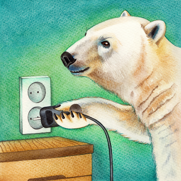

# How you (yes, you!) can write a Polars Plugin

Polars Plugins can give you superpowers!

Even with just basic Rust skills, you can leverage their power
to solve virtually any problem you may have in a performant manner.

This tutorial is just meant to get you started. We'll make a Polars Plugin with
some basic functionality - you can then customise it according to your own needs!

Code to follow along is here: https://github.com/MarcoGorelli/polars-plugins-tutorial.

Let's get this party started!
