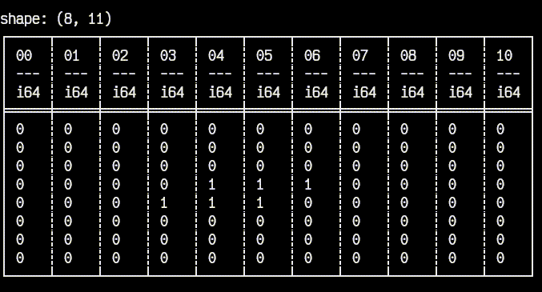

# Extra.2 Plugin user

In the last section we saw what the plugin developers made available for a plugin user.
Now we put the user's hat and demonstrate that _usage_.
For this, we'll implement a CLI app that will parse a board file provided as an argument, then run a step of the simulation every `delay` seconds (also provided as an argument).

> Tip: place the code from this section in a separate file, e.g., `run.py`.

Just like what we did previously, let's look at an overview of what's to come:

```python
import argparse
import contextlib
import io
import sys
from time import sleep

from game_of_life import parse_board, board_to_df, step
import polars as pl


class Application:

    # Initialize the board
    def __init__(self): ...

    # Printing the application object prints the board
    def __str__(self) -> str: ...

    # Run a step of the simulation every `delay` steps, for `n` maximum steps
    def start(self, n, delay, print_df): ...
```

Notice how we're importing `parse_board`, `board_to_df` and `step` from our fully-developed plugin.
This could've been installed with pip! Check the [publishing chapter](publishing.md) for more on this.

So first things first: `__init__`.
Here we use the stdlib `argparse` module to capture the command line arguments we mentioned above.
Then, we call `board_to_df` with the result of `parse_board`, storing the resulting DataFrame in the `Application` object itself.

```python
class Application:

    def __init__(self):
        self._args = argparse.Namespace()
        cli = argparse.ArgumentParser(
            prog="python -m game_of_life", description="Options"
        )
        cli.add_argument("-i", "--input", type=str, required=True)
        cli.add_argument("-d", "--delay", type=float, default=0.2)
        cli.add_argument("-n", "--num-steps", type=int, default=sys.maxsize)
        
        cli.parse_args(namespace=self._args)

        # [-i]
        self.ifile: str = self._args.input

        # [-d]
        self.delay: float = self._args.delay

        # [-n]
        self.steps: int = self._args.num_steps

        # Creates a pl.DataFrame from the provided file
        self.df = board_to_df(parse_board(self.ifile))
```

Next, an optional but handy detail - we implement `__str__` for `Application` in a way that printing an `Application` object will actually print the DataFrame stored internally:

```python
class Application:

    # ...

    def __str__(self) -> str:
        res = io.StringIO()
        with (
            pl.Config(tbl_rows=-1, tbl_cols=-1),
            contextlib.redirect_stdout(res),
        ):
            print(self.df)
        return res.getvalue()
```

The `pl.Config` part just removes the default row and column limits when displaying a DataFrame - otherwise we'd see ellipses (`...`) instead of `1`s and `0`s.

Finally, `start` is where we display the DataFrame and call `step` to advance the simulation, over and over:

```python
class Application:

    # ...

    def start(
            self,
            n: int | None = None,
            delay: float | None = None,
            print_df: bool = True,
    ):
        if n is None:
            n = self.steps

        if delay is None:
            delay = self.delay

        if print_df:
            print(self)

        iteration_cnt = 0
        try:
            for _ in range(n):
                self.df = step(self.df)
                iteration_cnt += 1
                if print_df:
                    # Clear screen
                    print("\033[2J")
                    print(self)
                sleep(delay)

        except KeyboardInterrupt:
            print(
                f"\nKeyboard Interrupt: ran for {iteration_cnt} iterations. Aborting..."
            )
            print(f"max_num_steps={self._args.num_steps}\ndelay={self._args.delay}")
```

To run the program, we only need two more things - an entry point and an input file.
Create a `toad.txt` in an `input` folder, containing:

```
00000000000
00000000000
00000000000
00001110000
00011100000
00000000000
00000000000
00000000000
```

and add this entry point at the end of `run.py`:

```python
if __name__ == "__main__":
    app = Application()
    app.start()
```

Now we can see the results of our work, at last:

```shell
# Compile the rust code
maturin develop --release

# Run the application
python run.py -i input/toad.txt -d 0.3
```



__Victory!__

## Reference

The entire code for this plugin, including the user's side can be found on [GitHub](https://github.com/condekind/life_polars_plugin).
