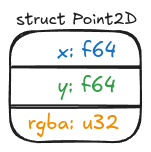
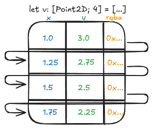
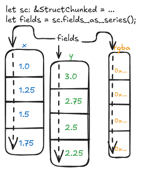

# 10. STRUCTin'

> "Day one, I'm in love with your struct" Thumpasaurus (kinda)

---

For this chapter, we need to start by activating the necessary feature - in `Cargo.toml`, please make this change:

```diff
-polars = { version = "0.44.2", default-features = false }
+polars = { version = "0.44.2", features=["dtype-struct"], default-features = false }
```

---

How do we consume structs, and how do we return them?

Let's try creating a Polars DataFrame in Python that stores a struct similar to this one:

```rust
struct Point2D {
    x: f64,
    y: f64,
    rgb: u32,
}
```

{ style="display: block; margin: 0 auto;" }

There are different ways of doing that, but that doesn't matter now. Here's one way:
```python
df = pl.DataFrame(
    {
        "x": [1.0, 1.25, 1.5, 1.75],
        "y": [3.0, 2.75, 2.5, 2.25],
        "rgba": [0x00FF7FFF, 0xFF7F00FF, 0x7F7F7FFF, 0xD8D8D8FF],
    }
).select(
    point_2d_s=pl.struct(
        "x", "y", "rgba",
        schema={
            "x": pl.Float64,
            "y": pl.Float64,
            "rgba": pl.UInt32,
        }
    )
)
```

If we `print(df)`, here's what we have:

```
shape: (4, 1)
┌────────────────────────┐
│ point_2d_s             │
│ ---                    │
│ struct[3]              │
╞════════════════════════╡
│ {1.0,3.0,16744447}     │
│ {1.25,2.75,4286513407} │
│ {1.5,2.5,2139062271}   │
│ {1.75,2.25,3638089983} │
└────────────────────────┘
```

Now's an excellent time to ask: how's that stored in memory? Before we get to that answer, consider this other scenario, in Rust:

```rust
let v: [Point2D; 4] = [
    Point2D {
        x: 1.0,
        y: 3.0,
        rgb: 0x00FF7FFFu32,
    },
    Point2D {
        x: 1.25,
        y: 2.75,
        rgb: 0xFF7F00FFu32,
    },
    Point2D {
        x: 1.5,
        y: 2.5,
        rgb: 0x7F7F7FFFu32,
    },
    Point2D {
        x: 1.75,
        y: 2.25,
        rgb: 0xD8D8D8FFu32,
    },
];
```

How's this one stored in memory? You might find that answer easier, it's an array of struct instances, so we have the `x`, `y` and `rgba` fields contiguously in memory, like that:

{ style="display: block; margin: 0 auto;" }

This is consistent with how C, C++, and many other languages store structs in memory.
How's our struct-in-a-DataFrame different?

Polars follows the Arrow protocol for structs, which means each field of the struct is stored in a Series, backed by chunks. Each chunk is contiguous in memory.
In a scenario in which we have a single chunk for each field, this is how things would look like:

{ style="display: block; margin: 0 auto;" }

Since we never modified the DataFrame after creating it, it is the case of our initial example, no more chunks were allocated.

---

Now that we have a better idea of how things work under the hood, let's jump to a practical plugin that takes a struct, and just prints the Series corresponding to each field - it'll return the same struct passed as input, with no alteration.

First things first - this time we're gonna see somthing new. Polars does not allow us to write:

```rust
#[polars_expr(output_type=Struct)]
fn print_struct_fields(inputs: &[Series]) -> PolarsResult<Series> { ... }
```

The way we inform a struct Series is being returned is a bit cumbersome - we do so by defining a separate function:

```rust
fn struct_point_2d_output(input_fields: &[Field]) -> PolarsResult<Field> {
    let field = &input_fields[0];
    match field.dtype() {
        DataType::Struct(fields) => {
            Ok(Field::new("struct_point_2d".into(), DataType::Struct(fields.clone())))
        }
        dtype => polars_bail!(InvalidOperation: "expected Struct dtype, got {}", dtype),
    }
}
```

Then using that function in our `polars_expr`, with a different "kwarg":

```rust
#[polars_expr(output_type_func=struct_point_2d_output)]
fn print_struct_fields(inputs: &[Series]) -> PolarsResult<Series> {

    let struct_ = inputs[0].struct_()?;
    let fields = struct_.fields_as_series();

    if fields.is_empty() {
        return Ok(inputs[0].clone());
    }

    let fields = fields
        .iter()
        .map(|s| {
            let s = s.clone();
            println!("{:?}", s);
            s
        })
        .collect::<Vec<_>>();

    StructChunked::from_series(struct_.name().clone(), struct_.len(), fields.iter())
        .map(|ca| ca.into_series())
}
```

This is a very basic, "do-nothing" example. For this reason, we're not gonna spend too much time here.
Still, you're encouraged to register the plugin and try it for yourself, as an exercise.

Now, let's look at something more interesting.

---

We'll rewrite a plugin which takes a `Struct` as
input, and shifts all values forwards by one key. So, for example, if
the input was `{'a': 1, 'b': 2., 'c': '3'}`, then the output will be
`{'a': 2., 'b': '3', 'c': 1}`.

On the Python side, usual business:

```python
def shift_struct(expr: IntoExprColumn) -> pl.Expr:
    return register_plugin_function(
        args=[expr],
        plugin_path=LIB,
        function_name="shift_struct",
        is_elementwise=True,
    )
```

Then, we need to get the schema right.

```Rust
fn shifted_struct(input_fields: &[Field]) -> PolarsResult<Field> {
    let field = &input_fields[0];
    match field.dtype() {
        DataType::Struct(fields) => {
            let mut field_0 = fields[0].clone();
            let name = field_0.name.clone();
            field_0.set_name(fields[fields.len() - 1].name().clone());
            let mut fields = fields[1..]
                .iter()
                .zip(fields[0..fields.len() - 1].iter())
                .map(|(fld, name)| Field::new(name.name().clone(), fld.dtype().clone()))
                .collect::<Vec<_>>();
            fields.push(field_0);
            Ok(Field::new(name, DataType::Struct(fields)))
        }
        _ => unreachable!(),
    }
}
```

In this case, I put the first field's name as the output struct's name, but it doesn't
really matter what we put, as Polars doesn't allow us to rename expressions within
plugins. You can always rename on the Python side if you really want to, but I'd suggest
to just let Polars follow its usual "left-hand-rule".

The function definition is going to follow a similar logic:

```rust
#[polars_expr(output_type_func=shifted_struct)]
fn shift_struct(inputs: &[Series]) -> PolarsResult<Series> {
    let struct_ = inputs[0].struct_()?;
    let fields = struct_.fields_as_series();
    if fields.is_empty() {
        return Ok(inputs[0].clone());
    }
    let mut field_0 = fields[0].clone();
    let name = field_0.name().clone();
    field_0.rename(fields[fields.len() - 1].name().clone());
    let mut fields = fields[1..]
        .iter()
        .zip(fields[..fields.len() - 1].iter())
        .map(|(s, name)| {
            let mut s = s.clone();
            s.rename(name.name().clone());
            s
        })
        .collect::<Vec<_>>();
    fields.push(field_0);
    StructChunked::from_series(name, struct_.len(), fields.iter()).map(|ca| ca.into_series())
}
```

Let's try this out. Put the following in `run.py`:

```python
import polars as pl
import minimal_plugin as mp

df = pl.DataFrame(
    {
        "a": [1, 3, 8],
        "b": [2.0, 3.1, 2.5],
        "c": ["3", "7", "3"],
    }
).select(abc=pl.struct("a", "b", "c"))
print(df.with_columns(abc_shifted=mp.shift_struct("abc")))
```

Compile with `maturin develop` (or `maturin develop --release` if you're
benchmarking), and if you run `python run.py` you'll see:

```
shape: (3, 2)
┌─────────────┬─────────────┐
│ abc         ┆ abc_shifted │
│ ---         ┆ ---         │
│ struct[3]   ┆ struct[3]   │
╞═════════════╪═════════════╡
│ {1,2.0,"3"} ┆ {2.0,"3",1} │
│ {3,3.1,"7"} ┆ {3.1,"7",3} │
│ {8,2.5,"3"} ┆ {2.5,"3",8} │
└─────────────┴─────────────┘
```

The values look right - but is the schema?
Let's take a look

```
import pprint
pprint.pprint(df.with_columns(abc_shifted=mp.shift_struct("abc")).schema)
```

```
OrderedDict([('abc', Struct({'a': Int64, 'b': Float64, 'c': String})),
             ('abc_shifted', Struct({'a': Float64, 'b': String, 'c': Int64}))])
```

Looks correct!
